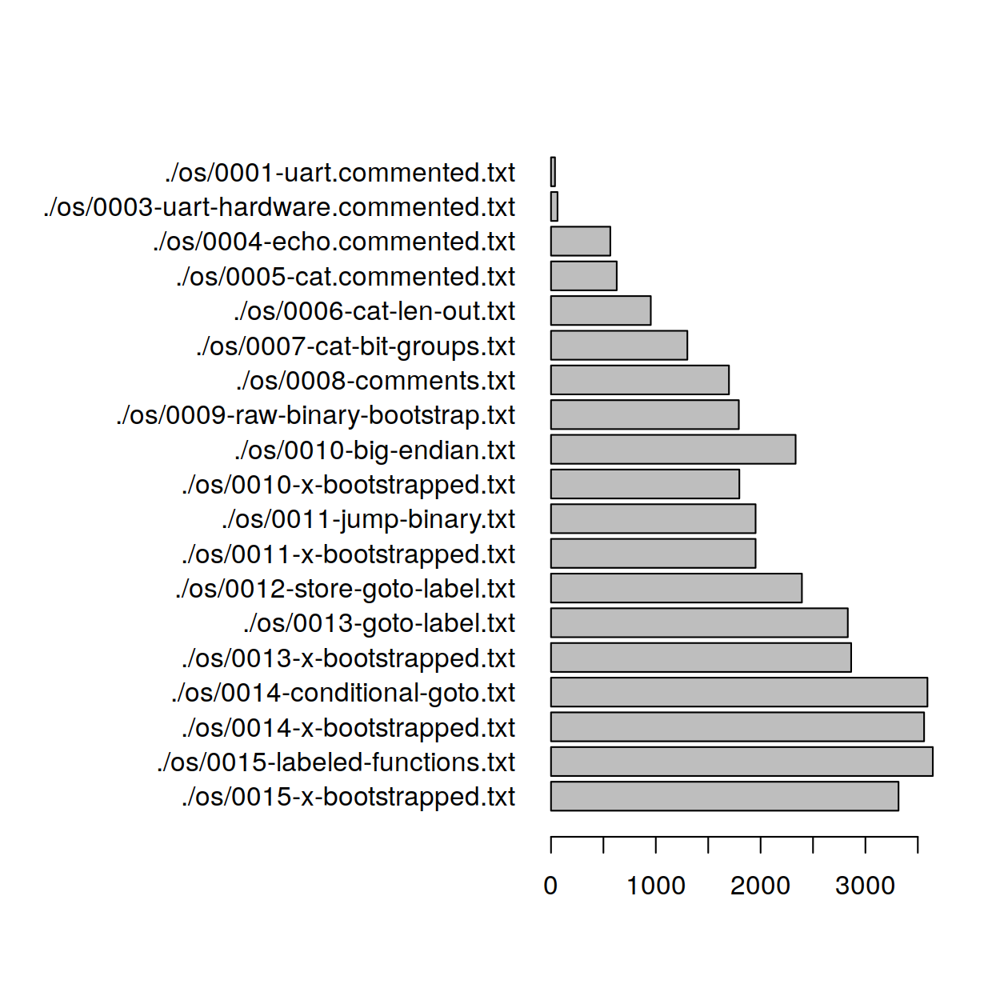

# bootstrapOS

Many OS tutorials start in assembly or C++. We start in machine code.

In this Raspberry Pi 4 tutorial, we'll write a self-hosted assembler in machine code. We'll then evolve that compiler (by implementing new features then using those features in the compiler source code) into something capable of wrangling a high-level language. Finally, in our high-level language, where most tutorials start, we'll write a simple web server to one day host the tutorial's own documentation.

### Progress

**Milestone: bootstrap machine code 🎉**
- [x] print to qemu uart
- [x] properly setup uart, wait for write, print 'x'
- [x] wait for read, read, print uart input
- [x] write all to memory then dump memory in
- [x] copy mem_in to mem_out then modify above code to print mem_out
- [x] use bytes to indicate length of output
- [x] routine to read a certain number of bits to memory, use it to copy machine code
- [x] remove leading whitespace, `;` command for comments
- [x] print raw binary

**Milestone: big-endian machine code 🎉**
- [x] print binary in little-endian form
- [x] rewrite codebase in big-endian form (ehh, leave most formatting for later)

**Milestone: labeled goto 🎉**
- [x] `J`: relative branch with binary
- [x] `L`: label for goto (read into memory tape with scheme `pos4 name \0`)
- [x] `GOTO`: goto label
- [x] rewrite codebase using labeled GOTOs 

**Milestone: conditional goto 🎉**
- [x] `GOEQ`
- [x] `GONE`
- [x] `GOGT`
- [x] `GOLT`
- [x] `GOGE`
- [x] `GOLE`
- [x] rewrite codebase using conditional goto

**Milestone: labeled functions**
- [x] `CALL`: "goto" but with linked branching
- [ ] `RET`: return after function call
- [ ] rewrite codebase

**Milestone: emitting strings**
- [ ] `EMIT string`: macro for series of `MOV reg char` and `CALL emit` with escape sequence support
- [ ] rewrite codebase

**Milestone: bootstrap assembly**
- [ ] `MOV reg hex`
- [ ] `MOV reg char` (with escape sequences)
- [ ] `MOV reg dec`
- [ ] `MOV reg reg`
- [ ] `ADD reg reg [reg/value]`: set the value of a register
- [ ] `SUB reg reg [reg/value]`: set the value of a register
- [ ] `LDB reg reg_mem offset`: load a byte
- [ ] `STB reg reg_mem offset`: store a byte
- [ ] `ORR reg reg (reg >>/<< value)`
- [ ] `AND reg reg (reg >>/<< value)`

**Milestone: stack-lang functions**
- [ ] `.func [name] [num locals]`
- [ ] `.call [name]`

**Milestone: push, pop, and dup**
- [ ] `.push constant [val]`
- [ ] `.dup`

- [ ] `.pop local [idx]`
- [ ] `.push local [idx]`

- [ ] `.pop param [idx]`
- [ ] `.push param [idx]`

- [ ] `.pop global [idx]`
- [ ] `.push global [idx]`


**Milestone: stack-lang memory access**
- [ ] `.load` (..., addr) -> (..., val)
- [ ] `.store` (..., val, addr) -> (...)

**Milestone: arithmetic**
- [ ] `.add`
- [ ] `.sub`

**Milestone: heap allocation**
- [ ] `malloc` stack function (..., num bytes) -> (..., addr)

**Milestone: parsing and compiling**
- [ ] constants
- [ ] unary operations
- [ ] binomial operations
- [ ] global variable declarations
- [ ] basic functions (with goto for `fn main`)
- [ ] function calling and parameters
- [ ] local variables
- [ ] conditional blocks
- [ ] loops
- [ ] break from loops

---

- [ ] refactor circle library's ethernet driver
- [ ] rewrite ethernet driver in our high-level language
- [ ] TCP/IP stack
- [ ] http server
- [ ] serve multiple files
- [ ] preemptive multitasking

# Lines of code over time



```
for f in ./os/*.txt; do wc -l $f; done | Rscript bar-gen.R ; feh ./loc-stats.png
```
